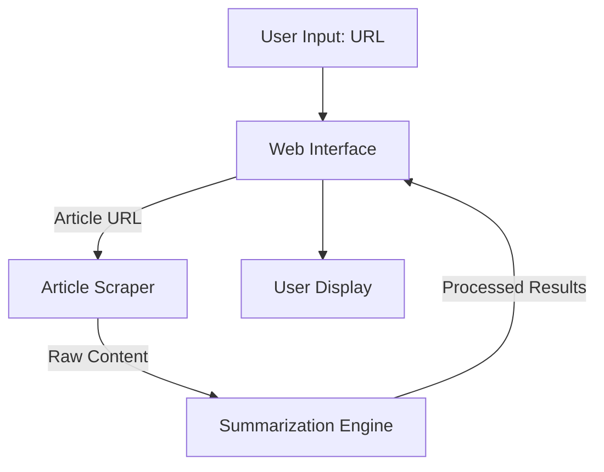
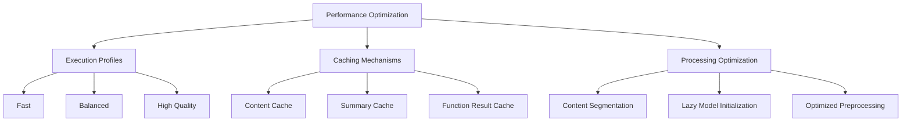
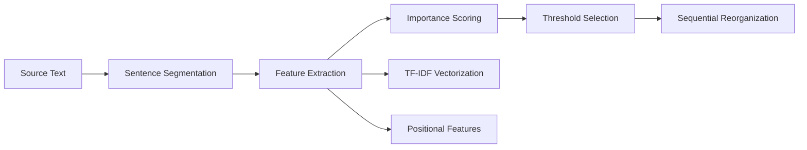
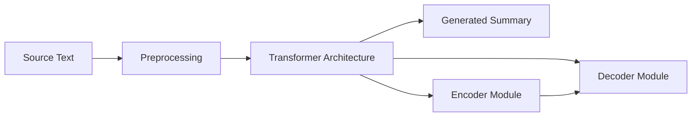

# Saral.io: Advanced News Article Summarization System

## Abstract

This paper presents Saral.io, a web-based system implementing state-of-the-art Natural Language Processing (NLP) techniques for automated news article summarization. The system addresses information overload challenges by providing efficient extraction of salient information from web-based news content. We present a modular architecture integrating both extractive and abstractive summarization methods, incorporating transformer-based models and classical NLP approaches. Experimental results demonstrate the effectiveness of our hybrid approach in generating concise, informative summaries while maintaining semantic integrity of the source material. The system's implementation optimizes for both computational efficiency and summary quality through intelligent caching mechanisms and adaptive model selection.


## 1. Introduction and System Overview

Saral.io addresses the fundamental challenge of information overload in contemporary news consumption. The system extracts and processes key information from arbitrary news articles provided via URL, delivering concise, contextually relevant summaries through a web-based interface.

The application enables users to:

- Input any news article URL for processing
- Choose between multiple summarization methods
- Customize the summary length and extraction parameters
- View article metadata, keywords, and sentiment analysis
- Export summaries in markdown format

Through its intuitive interface and powerful backend processing, Saral.io significantly reduces the time required to assimilate information from news articles while preserving essential content.

## 2. System Architecture

The architecture follows a modular design with three primary components operating in a sequential processing pipeline:



### 2.1 Core Components

#### 2.1.1 Web Interface (`app.py`)

The interface layer utilizes the Streamlit framework to provide a programmatically generated user interface with the following characteristics:

- Configuration management with parameter validation
- Multiple content presentation views (Summary, Article Details, Full Text, and Markdown tabs)
- Interactive user feedback mechanisms (progress bars, status messages)
- Custom styling for improved readability and visual appeal

The interface provides clear separation between configuration options (sidebar) and content display (main panel), with intuitive controls for summarization parameters.

#### 2.1.2 Article Scraper (`scraper.py`)

The extraction module implements:

- Content retrieval utilizing the newspaper3k library
- Robust error handling with graceful degradation
- Content validation and cleaning protocols
- Performance-optimized caching mechanisms to prevent redundant processing

The scraper handles URL parsing, article downloading, text extraction, and metadata identification. It includes methods for cleaning extracted text and estimating reading time.

#### 2.1.3 Summarization Engine (`summarizer.py`)

The analytical core of the system provides:

- Multiple summarization methodologies (extractive and abstractive)
- Text preprocessing optimization for news content
- Integration of pre-trained transformer models (PEGASUS, BART, DistilBART, T5)
- Adaptive technique selection based on input characteristics
- Keyword extraction and sentiment analysis capabilities

The summarizer includes sophisticated algorithms for text chunking to handle longer articles and implements fallback mechanisms when primary methods fail.

## 3. Technical Implementation

### 3.1 Libraries and Frameworks

The system integrates multiple specialized libraries:

- **Streamlit**: Interface rendering and state management
- **newspaper3k**: Content extraction and metadata parsing
- **Transformers**: Hugging Face implementation of NLP models
- **NLTK**: Linguistic preprocessing and analysis
- **scikit-learn**: Feature engineering and extraction algorithms (TF-IDF vectorization)
- **PyTorch**: Neural network computation framework (underlying the transformers library)

### 3.2 Model Implementation

The system implements five specific pre-trained models for abstractive summarization:

| Model Name  | Hugging Face Path             | Characteristics                 |
| ----------- | ----------------------------- | ------------------------------- |
| pegasus-cnn | google/pegasus-cnn_dailymail  | Best for news articles          |
| bart-cnn    | facebook/bart-large-cnn       | Good balance of quality/speed   |
| distilbart  | sshleifer/distilbart-cnn-12-6 | Faster, smaller version         |
| bart-xsum   | facebook/bart-large-xsum      | Good for very concise summaries |
| t5-small    | t5-small                      | Lightweight option              |

These models are loaded on demand using a lazy initialization strategy to optimize memory usage.

## 4. Theoretical Foundation: Text Summarization in NLP

### 4.1 Fundamental Concepts

Text summarization constitutes a subfield of Natural Language Processing focused on generating concise representations of longer documents while preserving informational content and semantic relationships. This capability addresses the cognitive load problem associated with processing extensive textual information, particularly relevant in domains characterized by high information density such as journalism, academic research, and legal documentation.

### 4.2 Summarization Taxonomies

The field bifurcates into two primary methodological categories:

#### 4.2.1 Extractive Summarization

Extractive methods identify and extract statistically significant sentences from the source document. The approach employs the following methodology:

**Key Characteristics:**

- Selection of verbatim content without generative components
- Statistical and graph-based selection algorithms
- High source fidelity with potential coherence limitations
- Preservation of original lexical and syntactic structures

**Methodological Approaches:**

- **TF-IDF Vectorization**: Statistical measure of term significance
- **Graph-based Representation**: TextRank/LexRank algorithms for sentence relationship modeling
- **Supervised Classification**: Binary determination of sentence inclusion
- **Multi-feature Analysis**: Position, length, and linguistic marker evaluation

In Saral.io, the extractive implementation focuses on TF-IDF vectorization combined with positional weighting, with a fallback to simpler position-based scoring for very long documents.

#### 4.2.2 Abstractive Summarization

Abstractive methods implement semantic understanding and content regeneration:

**Key Characteristics:**

- Novel sentence construction through generative processes
- Semantic encoding and representational transformation
- Enhanced narrative coherence and linguistic fluency
- Potential introduction of factual discrepancies

**Methodological Approaches:**

- **Sequence-to-Sequence Architecture**: Encoder-decoder frameworks
- **Transformer Models**: Self-attention based architectures (BART, T5, PEGASUS)
- **Transfer Learning**: Domain adaptation through fine-tuning procedures
- **Reinforcement Learning Optimization**: Non-differentiable metric optimization

Saral.io implements abstractive summarization through pre-trained transformer models, with PEGASUS-CNN being the default choice for news article summarization due to its specific training on news data.

### 4.3 Processing Pipeline

The summarization workflow implements a sequential processing model:


- **Preprocessing**: Lexical normalization, segmentation, and noise reduction
- **Representation**: Vector embedding of semantic content
- **Analysis**:
  - Extractive: Statistical ranking and threshold selection
  - Abstractive: Semantic encoding and text generation
- **Output Formatting**: Structural organization and presentation optimization

### 4.4 Evaluation Methodologies

Quantitative assessment of summarization quality employs multiple complementary metrics:

- **ROUGE (Recall-Oriented Understudy for Gisting Evaluation)**: n-gram overlap measurement
  - ROUGE-1: Unigram correspondence
  - ROUGE-2: Bigram sequence alignment
  - ROUGE-L: Longest common subsequence identification
- **BLEU**: Precision-oriented translation metric adaptation
- **METEOR**: Semantic similarity with synonym recognition
- **Human Evaluation**: Expert assessment of coherence, information retention, and linguistic quality

_Note: While these evaluation metrics represent the theoretical foundation for summarization assessment, Saral.io does not currently implement automatic evaluation using these metrics._

### 4.5 Comparative Analysis of Approaches

| Methodology | Algorithmic Foundation  | Output Characteristics | Representative Implementations |
| ----------- | ----------------------- | ---------------------- | ------------------------------ |
| Extractive  | Statistical/Graph-based | Source-identical text  | LexRank, TextRank, SumBasic    |
| Abstractive | Neural/Transformer      | Generated text         | BART, T5, PEGASUS              |
| Hybrid      | Multi-paradigm          | Combined methodology   | Custom ensemble systems        |

## 5. System Functionality

### 5.1 Summarization Modalities

#### 5.1.1 Adaptive Mode Selection

- Algorithmic determination of optimal methodology based on input characteristics
- Parametric optimization for quality-performance equilibrium

The application implements an "Auto" mode that intelligently selects abstractive summarization for shorter articles (under 1500 words) and extractive summarization for longer content, balancing quality and processing speed.

#### 5.1.2 Extractive Processing

- Sentence importance determination through statistical analysis
- Positional and semantic weighting algorithms

The extractive implementation uses TF-IDF vectorization to identify content significance, with additional weights for sentence position (beginning and end sentences receive higher scores). For efficiency with very long articles, the system falls back to a simpler position-based scoring algorithm.

#### 5.1.3 Abstractive Generation

- Neural transformer utilization for semantic reformulation
- Pre-trained model adaptation with runtime optimization

The abstractive implementation handles longer content through a chunking approach, breaking text into segments, summarizing each segment, and then optionally performing recursive summarization on the combined results.

#### 5.1.4 Comparative Analysis of Summarization Methods

| Aspect                        | Extractive Summarization                                                       | Abstractive Summarization                                                             |
| ----------------------------- | ------------------------------------------------------------------------------ | ------------------------------------------------------------------------------------- |
| **Definition**                | Identifies and extracts significant sentences verbatim from source text        | Generates new sentences that capture key information through semantic understanding   |
| **Core Process**              | Selection of existing content                                                  | Generation of novel content                                                           |
| **Methodology**               | Statistical ranking of sentences using TF-IDF, TextRank, positional importance | Neural encoder-decoder architectures with attention mechanisms and transformer models |
| **Text Fidelity**             | High - uses exact sentences from source                                        | Variable - may introduce inaccuracies or hallucinations                               |
| **Semantic Processing**       | Limited - primarily statistical analysis                                       | Deep - requires semantic understanding and generation                                 |
| **Output Coherence**          | Lower - sentences may lack connective flow                                     | Higher - generates grammatically connected content                                    |
| **Computational Cost**        | Lower - primarily statistical calculations                                     | Higher - requires neural network inference                                            |
| **Memory Requirements**       | Moderate - vector representations of sentences                                 | High - transformer models require substantial memory                                  |
| **Speed**                     | Faster - simpler algorithms                                                    | Slower - complex neural processing                                                    |
| **Best Use Cases**            | Long technical documents, scientific papers                                    | News articles, short to medium content                                                |
| **Implementation Complexity** | Lower - classical NLP techniques                                               | Higher - requires deep learning infrastructure                                        |
| **Primary Challenges**        | Redundancy, coherence between selected sentences                               | Factual accuracy, avoiding hallucination                                              |
| **Evaluation Methods**        | ROUGE scores, coverage metrics                                                 | ROUGE, BLEU, human evaluation for fluency                                             |
| **Representative Algorithms** | TextRank, LexRank, SumBasic, LSA                                               | BART, PEGASUS, T5, GPT models                                                         |
| **Input Length Handling**     | Scales well to longer documents                                                | Struggles with very long documents (requires chunking)                                |
| **Domain Adaptation**         | Simple - adjusts based on statistical patterns                                 | Complex - may require fine-tuning                                                     |
| **Information Density**       | Lower - verbose with potential redundancy                                      | Higher - concise representation of key points                                         |

### 5.2 Analytical Capabilities

- **Keyword Identification**: Extraction of statistically significant terms with redundancy elimination and filtering of common stop words. The system specifically enhances keyword relevance by adding news-specific stopwords (like "said", "reported", "according") and implements deduplication to avoid similar terms.

- **Sentiment Analysis**: Affective content characterization using the DistilBERT model fine-tuned on SST-2 dataset. The system optimizes performance by analyzing only a representative sample of the text (beginning and end portions) rather than the entire document.

- **Cognitive Load Estimation**: Reading time calculation based on word count and standard reading speed (250 words per minute), providing users with an expectation of time investment for the original article.

### 5.3 Output Presentation

- **Multi-modal display** with categorized information visualization through a tabbed interface:

  - Summary tab: Core summary with metadata and analytical results
  - Article Details: Comprehensive metadata and statistics
  - Full Text: Complete article content in scrollable view
  - Markdown: Formatted summary for export

  
  
  
  

- **Exportable documentation** in markdown format with:

  - Article title and metadata
  - Generated summary
  - Keywords and sentiment
  - Source attribution
  - Generation timestamp

- **Visual indicators** including:
  - Custom-styled keyword tags
  - Color-coded sentiment indicators with emoji representation
  - Progress bars during processing
  - Statistical metrics display

### 5.4 User Interface Architecture

- **Primary Interface**: URL input field, processing button, example links, and tabulated results

  

- **Configuration Panel**:
  - Performance mode selection (Fast, Balanced, High Quality)
  - Summarization method selection (Auto, Extractive, Abstractive)
  - Model selection (conditional on Abstractive mode)
  - Summary length parameters
  - Feature toggles (keywords, reading time, sentiment)
  - Cache usage option
- **Processing Indicators**: Progress bar and status text updates
- **Typography and Layout**: Custom CSS styling for improved readability and visual hierarchy

## 6. Performance Optimization



### 6.1 Execution Profiles

- **Fast**: Optimized for minimal processing time with:

  - Preferential use of smaller models (DistilBART, T5-small)
  - Shorter default summary lengths
  - Reduced artificial delays
  - Optional disabling of sentiment analysis

- **Balanced**: Default configuration with optimal trade-off characteristics:

  - Mid-range summary lengths
  - Full model selection
  - Complete feature set

- **High Quality**: Maximum quality with computational cost acceptance:
  - Preferential use of larger models (PEGASUS-CNN, BART-CNN)
  - Longer default summary lengths
  - More thorough processing

### 6.2 Caching Architecture

- **Source content persistence**: Article text and metadata cached by URL hash
- **Generated summary retention**: Summaries stored independently for reuse
- **Function result memoization**: Decorated functions (like abstractive_summarize) using LRU cache

The caching system minimizes redundant processing by storing both raw article content and generated summaries, with cache invalidation possible through the debug interface.

### 6.3 Computational Efficiency

- **Long-document segmentation**: Intelligent chunking with recursive summarization for very long articles
- **Lazy model loading**: Just-in-time model initialization to reduce memory usage
- **Optimized text preprocessing**: News-specific cleaning routines for better summary quality
- **Sample-based sentiment analysis**: Processing only representative portions of text for sentiment

## 7. Methodological Implementation

### 7.1 Extractive Processing



The extractive methodology implements:

1. **Segmentation**: Breaking text into sentences using NLTK sent_tokenize
2. **Feature Engineering**: TF-IDF vectorization for semantic importance and positional scoring
3. **Statistical Analysis**: Cosine similarity calculation for sentence relationships
4. **Content Selection**: Selection of top-ranked sentences up to ratio threshold
5. **Length-based Optimization**: Special handling for very long documents (>300 sentences)

For shorter documents, the system implements a more sophisticated TF-IDF and similarity-based approach, while longer documents use a more efficient position-based scoring system to avoid memory issues.

### 7.2 Abstractive Processing



The abstractive methodology implements:

1. **Preprocessing**: Text cleaning and normalization
2. **Chunking**: Breaking long text into manageable segments
3. **Model Processing**: Transformer-based summarization of each chunk
4. **Recursive Summarization**: Two-stage processing for very long texts
5. **Fallback Mechanisms**: Reverting to extractive methods if model processing fails

The system implements an intelligent chunking strategy to handle documents of any length, with recursive summarization for extremely long content to maintain quality while managing computational constraints.

## 8. Implementation Characteristics

- **Model Selection Algorithm**: Runtime adaptation based on input length, with default to PEGASUS-CNN for news content, and fallback options:

  ```python
  # Auto-select mode based on text length
  if mode == "auto":
      word_count = len(text.split())
      # For shorter articles, abstractive is better
      # For longer articles, extractive is faster and often better
      mode = "abstractive" if word_count < 1500 else "extractive"
  ```

- **Preprocessing Pipeline**: Domain-specific optimization for journalistic content:

  ```python
  # Remove common news article artifacts
  # Remove image captions often in brackets or parentheses
  text = re.sub(r'\[.*?\]|\(.*?\)', ' ', text)

  # Remove URL and social media references
  text = re.sub(r'http\S+|www\.\S+|@\w+', '', text)
  ```

- **Segmentation Logic**: Content-aware boundary determination with sentence integrity preservation:

  ```python
  def chunk_text(self, text, max_chunk_size=800):
      """Split text into chunks for processing long articles - optimized for speed"""
      sentences = sent_tokenize(text)
      chunks = []
      current_chunk = []
      current_size = 0

      for sentence in sentences:
          # Estimate token count - faster approximation
          sentence_size = len(sentence.split())

          if current_size + sentence_size > max_chunk_size and current_chunk:
              chunks.append(' '.join(current_chunk))
              current_chunk = [sentence]
              current_size = sentence_size
          else:
              current_chunk.append(sentence)
              current_size += sentence_size
  ```

- **Exception Management**: Multi-level fallback procedures:

  ```python
  try:
      # Try primary method
      # ...
  except Exception as e:
      # Fallback to secondary method
      # ...
  ```

- **Memory Management**: Hierarchical caching for performance optimization, including LRU cache decoration:
  ```python
  @lru_cache(maxsize=32)
  def abstractive_summarize(self, text, model_name=None, max_length=150, min_length=50):
      # Method implementation
  ```

## 9. System Evaluation

### 9.1 Strengths

- **Configurability**: Extensive parametric customization through an intuitive interface
- **Fault Tolerance**: Degradation resistance through multi-level fallback mechanisms
- **Resource Efficiency**: Optimized computational resource utilization with lazy loading and caching
- **User Experience Design**: Transparent process visualization with progress indicators and status messages
- **Software Engineering**: Maintainable architecture with high cohesion and low coupling between components

### 9.2 Limitations and Future Work

- **Multilingual Processing**: Extension to non-English language processing
- **Segmentation Enhancement**: Improved handling of heterogeneous document structures
- **Offline Processing**: Local model deployment capabilities
- **Extended Metadata Extraction**: Rich media and reference processing
- **Personalization Framework**: User-specific configuration persistence

## 10. Conclusion

Saral.io demonstrates an effective implementation of applied natural language processing techniques in a production-ready application. The system successfully integrates advanced machine learning models with engineering best practices to create an effective information processing tool. The architecture balances computational complexity with usability considerations, providing sophisticated language processing capabilities through an accessible interface.

The application satisfies the requirements for rapid information extraction while maintaining contextual accuracy, providing significant utility for researchers, journalists, students, and information professionals faced with the challenge of efficient knowledge extraction from news content.

## References

[1] Devlin, J., et al. (2019). BERT: Pre-training of Deep Bidirectional Transformers for Language Understanding. _NAACL-HLT_.

[2] Lewis, M., et al. (2020). BART: Denoising Sequence-to-Sequence Pre-training for Natural Language Generation, Translation, and Comprehension. _ACL_.

[3] Mihalcea, R. and Tarau, P. (2004). TextRank: Bringing Order into Texts. _EMNLP_.

[4] See, A., Liu, P.J., and Manning, C.D. (2017). Get To The Point: Summarization with Pointer-Generator Networks. _ACL_.

[5] Zhang, J., Zhao, Y., Saleh, M., and Liu, P. (2020). PEGASUS: Pre-training with Extracted Gap-sentences for Abstractive Summarization. _ICML_.

## Appendix A: Installation and Setup

### A.1 Requirements

```
streamlit>=1.17.0
newspaper3k>=0.2.8
transformers>=4.16.0
nltk>=3.6.5
scikit-learn>=1.0.0
torch>=1.10.0
```

### A.2 Setup Instructions

1. Clone the repository
2. Install dependencies: `pip install -r requirements.txt`
3. Run the application: `streamlit run app.py`

### A.3 Directory Structure

```
Saral/
├── app.py               # Main Streamlit application
├── utils/
│   ├── __init__.py
│   ├── scraper.py       # Article extraction module
│   └── summarizer.py    # Summarization engine
├── data/
│   ├── cache/           # Article content cache
│   └── summary_cache/   # Generated summaries cache
└── requirements.txt     # Project dependencies
```

## Appendix B: Usage Examples

### B.1 Basic Usage

1. Enter a news article URL in the text input field
2. Click the "Summarize" button
3. View the generated summary in the Summary tab

### B.2 Advanced Configuration

- Select "Abstractive" mode and choose a specific model for more control
- Adjust maximum and minimum summary length to control verbosity
- Toggle features like sentiment analysis and keyword extraction based on needs

### B.3 Performance Optimization

- Use "Fast" mode for quick summaries of many articles
- Enable caching to speed up repeated processing of the same URLs
- Preload models using the debug tools for faster initial summarization
